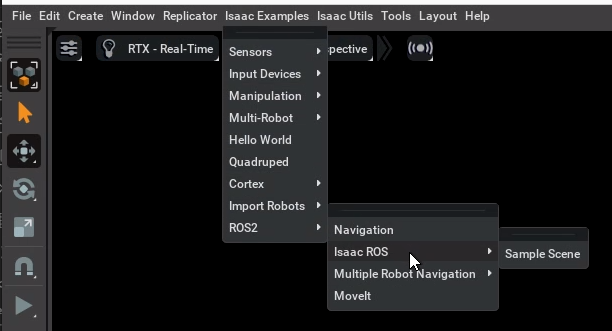

# Omniverse Isaac Sim Installation 

**Isaac Sim Version** : 4.1

**Isaac Sim Asset Version** : 4.1

There are two possible ways to develop in Isaac Sim:

1. Natively
2. Containerized 

For this project we use **Containerized Development** but you might need to do Omniverse Launcher for Native Streaming Client. Check [here](https://docs.omniverse.nvidia.com/isaacsim/latest/installation/install_container.html#isaac-sim-app-install-container) for more details.

### Container Setup
Install NVIDIA Driver:
```shell
sudo apt-get update
sudo apt install build-essential -y
wget https://us.download.nvidia.com/XFree86/Linux-x86_64/535.129.03/NVIDIA-Linux-x86_64-535.129.03.run
chmod +x NVIDIA-Linux-x86_64-535.129.03.run
sudo ./NVIDIA-Linux-x86_64-535.129.03.run
```

Install Docker:
```shell
# Docker installation using the convenience script
curl -fsSL https://get.docker.com -o get-docker.sh
sudo sh get-docker.sh

# Post-install steps for Docker
sudo groupadd docker
sudo usermod -aG docker $USER
newgrp docker

# Verify Docker
docker run hello-world
```

Install NVIDIA Container Toolkit:
```shell
# Configure the repository
curl -fsSL https://nvidia.github.io/libnvidia-container/gpgkey | sudo gpg --dearmor -o /usr/share/keyrings/nvidia-container-toolkit-keyring.gpg \
  && curl -s -L https://nvidia.github.io/libnvidia-container/stable/deb/nvidia-container-toolkit.list | \
    sed 's#deb https://#deb [signed-by=/usr/share/keyrings/nvidia-container-toolkit-keyring.gpg] https://#g' | \
    sudo tee /etc/apt/sources.list.d/nvidia-container-toolkit.list \
  && \
    sudo apt-get update

# Install the NVIDIA Container Toolkit packages
sudo apt-get install -y nvidia-container-toolkit
sudo systemctl restart docker

# Configure the container runtime
sudo nvidia-ctk runtime configure --runtime=docker
sudo systemctl restart docker

# Verify NVIDIA Container Toolkit
docker run --rm --runtime=nvidia --gpus all ubuntu nvidia-smi
```

### Container Development

- Once the container prerequisites are complete, we can now focus on getting the Isaac Sim container from [NGC Catalog](https://catalog.ngc.nvidia.com/?filters=&orderBy=weightPopularDESC&query=&page=&pageSize=).

- Get access to [Isaac Sim Container](https://catalog.ngc.nvidia.com/orgs/nvidia/containers/isaac-sim) using your NVIDIA Developer Program Credentials.

- Before you could pull the Isaac Sim Container Image, you need to configure you **Docker CLI** with **nvcr.io** registry via [NGC API Key](https://docs.nvidia.com/ngc/gpu-cloud/ngc-user-guide/index.html#generating-api-key).

- Pull Isaac Sim Container:
```
docker pull nvcr.io/nvidia/isaac-sim:4.1.0
```

- Run Isaac Sim Container with an interactive bash session (Make sure to change PRIVACY_USERID=```<your_email>```):
```
docker run --name isaac-sim --entrypoint bash -it --runtime=nvidia --gpus all -e "ACCEPT_EULA=Y" --rm --network=host \
    -e "PRIVACY_CONSENT=Y" \
    -e "PRIVACY_USERID=<your_email>"
    -v ~/docker/isaac-sim/cache/kit:/isaac-sim/kit/cache:rw \
    -v ~/docker/isaac-sim/cache/ov:/root/.cache/ov:rw \
    -v ~/docker/isaac-sim/cache/pip:/root/.cache/pip:rw \
    -v ~/docker/isaac-sim/cache/glcache:/root/.cache/nvidia/GLCache:rw \
    -v ~/docker/isaac-sim/cache/computecache:/root/.nv/ComputeCache:rw \
    -v ~/docker/isaac-sim/logs:/root/.nvidia-omniverse/logs:rw \
    -v ~/docker/isaac-sim/data:/root/.local/share/ov/data:rw \
    -v ~/docker/isaac-sim/documents:/root/Documents:rw \
    nvcr.io/nvidia/isaac-sim:4.0.0
```
- There is bash script ```util_scripts/run_isaac_sim_container.sh``` which you can use to run Isaac Sim container.

- One thing to keep in mind is that 3D assets in Isaac Sim are accessed either via a cloud or local server called [Nucleus Server](https://docs.omniverse.nvidia.com/nucleus/latest/index.html) and setting them up repeatedly is resource intensive task hence NVIDIA also provides **Cache** for shaders. They are not configured by default to work with Isaac Sim Container and hence you need to configure them separately.

- Let's download [NVIDIA Omniverse Launcher](https://www.nvidia.com/en-us/omniverse/download/). Steps on how to install are [here](https://docs.omniverse.nvidia.com/launcher/latest/installing_launcher.html). Remember in Linux you would get an AppImage for which you have to provide execution access. Right click -> Properties -> Make executable.
- Once you have Omniverse Launcher up and running, perform following tasks:
	1. Setup Local Nucleus Server from NUCLEUS Tab
	2. Download Following Apps from EXCHANGE Tab
		-  OMNIVERSE CACHE
		-  OMNIVERSE STREAMING CLIENT
		-  ISAAC SIM ASSETS PACK 1
		-  ISAAC SIM ASSETS PACK 2
		-  ISAAC SIM ASSETS PACK 3
		-  ISAAC SIM ASSETS PACK 4
- **Note**: While setting up the Nucleus Server you will be prompted to add username and password, they are essentialto access the assets via Isaac Sim Container.

- There are multiple ways with which you can access Isaac Sim Assets in the container from Nucleus (More details [here](https://docs.omniverse.nvidia.com/isaacsim/latest/installation/install_faq.html#assets-and-nucleus)):
	1. Configure Omniverse Server in user.config.json file
	2. Pass Nucleus User Configuration as env to Docker
	3. Locally mount assets directory to the Docker
- The repo includes the assets you will require to run exploration hence its upto you how you want to integrate Nucleus server.

- Once the container is up, execute following in the container:
```
./runheadless.native.sh -v
```
- In the Omniverse Launcher, run the Omniverse Streaming Client


### ROS2-Bridge Setup
- ROS 2 installation in Linux can take place in following two ways:
	1. System wide install
	2. Container install

- We will go with the second option since it requires minimum changes to core Isaac Sim container.

- Following FastDDS XML file is already provided in the project repo with which Isaac Sim pre-compiled ROS 2 Humble library could be used.

```xml
<!--File Name - fastdds.xml-->

<?xml version="1.0" encoding="UTF-8" ?>

<license>Copyright (c) 2024, NVIDIA CORPORATION.  All rights reserved.
NVIDIA CORPORATION and its licensors retain all intellectual property
and proprietary rights in and to this software, related documentation
and any modifications thereto.  Any use, reproduction, disclosure or
distribution of this software and related documentation without an express
license agreement from NVIDIA CORPORATION is strictly prohibited.</license>


<profiles xmlns="http://www.eprosima.com/XMLSchemas/fastRTPS_Profiles" >
    <transport_descriptors>
        <transport_descriptor>
            <transport_id>UdpTransport</transport_id>
            <type>UDPv4</type>
        </transport_descriptor>
    </transport_descriptors>

    <participant profile_name="udp_transport_profile" is_default_profile="true">
        <rtps>
            <userTransports>
                <transport_id>UdpTransport</transport_id>
            </userTransports>
            <useBuiltinTransports>false</useBuiltinTransports>
        </rtps>
    </participant>
</profiles>
```

- Once you are inside Isaac Sim container, you can use following bash file:
```bash
# File Name - enable_ros2_bridge.sh

#!/bin/bash

# Set base path of Isaac Sim Package
export isaac_sim_package_path=/isaac-sim

# Set your RMW IMPLEMENTATION Type
export RMW_IMPLEMENTATION=rmw_fastrtps_cpp

# Connect the humble library to our LD_LIBRARY_PATH
export LD_LIBRARY_PATH=$LD_LIBRARY_PATH:$isaac_sim_package_path/exts/omni.isaac.ros2_bridge/humble/lib

# Finally set the Default DDS profile
export FASTRTPS_DEFAULT_PROFILES_FILE=~/humble_ws/fastdds.xml
```

### ROS2-Bridge Extension
- The Isaac Sim Container launch bash script is configured to source enable_ros_bridge.sh script but if in case that fails, you can manually invoke it using following command:
```
source /isaac-sim/humble_ws/enable_ros_bridge.sh
```

- Now launch the Isaac Sim in headless mode:
```
	./isaac-sim.headless.native.sh --allow-root
```

- With the Omniverse Launcher, run the Omniverse Streaming Client

- To enable ROS 2 bridge extensions, go to the extension manager menu *Window->Extensions* and search for ROS 2 bridge. Only one of the ROS Bridge extensions can be enabled at any given time. If you are switching between the two bridges, disable one before enabling the other:

- The fastest way to test if the ROS2 bridge is working as expected is by launching a Isaac ROS sample scene which you can find in *Isaac Examples -> ROS2 -> Isaac ROS -> Sample Scene*.


- Once the scene loads up, make sure to play the simluation:


- If you have ROS 2 installed system wide on the host, then you can check the topics which are being published using:
```
ros2 topic list
```

**Note**: If you would like to test via Docker wherein you don't have to install ROS 2 Humble system wide then refer the documentation [here](https://docs.omniverse.nvidia.com/isaacsim/latest/installation/install_ros.html#running-ros-in-docker-containers).


### Docker Compose Setup
- Install Docker Compose using instructions [here](https://docs.docker.com/compose/install/).

- You will find docker-compose.yml file in the util_scripts directory which is recommended instead of Docker since we will have Isaac ROS Container for Nvblox library in a separate development container.

```yaml
# File Name - docker-compose.yml

services:
  isaac_sim:
    image: nvcr.io/nvidia/isaac-sim:4.1.0  # Docker Image
    container_name: isaac_sim  # Container Name
    runtime: nvidia  # Use NVIDIA runtime for GPU access
    volumes:
      - ~/docker/isaac-sim/cache/kit:/isaac-sim/kit/cache:rw
      - ~/docker/isaac-sim/cache/ov:/root/.cache/ov:rw
      - ~/docker/isaac-sim/cache/pip:/root/.cache/pip:rw
      - ~/docker/isaac-sim/cache/glcache:/root/.cache/nvidia/GLCache:rw
      - ~/docker/isaac-sim/cache/computecache:/root/.nv/ComputeCache:rw
      - ~/docker/isaac-sim/logs:/root/.nvidia-omniverse/logs:rw
      - ~/docker/isaac-sim/data:/root/.local/share/ov/data:rw
      - ~/docker/isaac-sim/documents:/root/Documents:rw
      - $PWD/ros2_bridge:/isaac-sim/ros2_bridge:rw
    environment:
      - LOG_LEVEL=DEBUG
      - ACCEPT_EULA=Y
      - PRIVACY_CONSENT=Y
      - PRIVACY_USERID=trushant@umich.edu  
      - RMW_IMPLEMENTATION=rmw_fastrtps_cpp
      - LD_LIBRARY_PATH=$LD_LIBRARY_PATH:/isaac-sim/exts/omni.isaac.ros2_bridge/humble/lib
      - FASTRTPS_DEFAULT_PROFILES_FILE=/isaac-sim/fastdds.xml
    deploy:
      resources:
        reservations:
          devices:
            - capabilities: [gpu] 
  
    network_mode: host
    restart: "no"  # No automatic restarts
    stdin_open: false # Keep stdin open (interactive mode)
    tty: true  # Enable TTY for interactive terminal

```

- Next you can launch the Isaac Sim Container using following command:
```shell
docker compose up
```